# Tài liệu Đặc tả Use Case
## Module: CMS Multi-Room Booking & Purchasing

---

## Thông tin tài liệu

| Thuộc tính | Giá trị |
| --- | --- |
| Tên tài liệu | Đặc tả Use Case – Module Booking & Purchasing |
| Hệ thống | CMS Multi-Room Booking & Purchasing |
| Phiên bản | 1.1 |
| Ngày tạo | 2026-06-09 |
| Cập nhật | 2026-06-09 - bổ sung phân hệ Kế toán & Công nợ (UC-13…UC-18); tích hợp Open Questions thành Quyết định đã chốt; thêm Phụ lục A - Ghi chú khảo sát yêu cầu |
| Trạng thái | Draft |
| Người tạo | Business Analyst Team |
| Phạm vi | Quản lý booking đa phòng, quy trình mua phòng từ supplier, và kế toán/công nợ |

---

## Mục lục

1. [Giới thiệu](#1-giới-thiệu)
2. [Phạm vi & Mục tiêu](#2-phạm-vi--mục-tiêu)
3. [Thuật ngữ & Định nghĩa](#3-thuật-ngữ--định-nghĩa)
4. [Danh sách Actor](#4-danh-sách-actor)
5. [Use Case Diagram tổng quan](#5-use-case-diagram-tổng-quan)
6. [Mô hình dữ liệu (ERD)](#6-mô-hình-dữ-liệu-erd)
7. [Đặc tả Use Case - Booking & Purchasing](#7-đặc-tả-use-case--booking--purchasing)
8. [Đặc tả Use Case - Kế toán & Công nợ](#8-đặc-tả-use-case--kế-toán--công-nợ)
9. [Order Status Lifecycle](#9-order-status-lifecycle)
10. [Tổng hợp Business Rules](#10-tổng-hợp-business-rules)
11. [Quyết định nghiệp vụ đã chốt](#11-quyết-định-nghiệp-vụ-đã-chốt)
12. [Phụ lục A - Ghi chú khảo sát yêu cầu](#phụ-lục-a--ghi-chú-khảo-sát-yêu-cầu)

---

## 1. Giới thiệu

Công ty hoạt động theo mô hình trung gian phân phối phòng/căn hộ:

1. Khách hàng đặt phòng trên các nền tảng OTA (Agoda, Trip.com, Booking.com, …).
2. Công ty nhận booking từ OTA.
3. Công ty đi thuê/mua phòng thực tế từ **Host** hoặc **Supplier**.
4. Công ty bán lại cho khách và hưởng phần **chênh lệch giá**.

CMS được xây dựng nhằm **thay thế quy trình vận hành thủ công hiện tại trên Lark Base**, giải quyết bài toán cốt lõi:

> Một booking từ OTA có thể chứa **nhiều phòng** thuộc **nhiều room type**. Hệ thống phải xử lý hoàn toàn tự động, tránh việc nhân viên phải copy record thủ công như hiện nay.

---

## 2. Phạm vi & Mục tiêu

### 2.1. Trong phạm vi (In-scope)

- Đồng bộ và tạo booking đơn/đa phòng từ OTA.
- Quản lý vòng đời booking (xem, chỉnh sửa, hủy).
- Quy trình purchasing: tìm phòng, gán supplier, gán phòng thực tế.
- Cơ chế notification theo purchase lead time của property.
- Quản lý cancellation policy ở cấp property.
- Audit trail đầy đủ, không hard delete.

### 2.2. Ngoài phạm vi (Out-of-scope)

- Tự động mua phòng (CMS chỉ thông báo, nhân viên xử lý thủ công).
- Cancellation policy ở cấp room type.
- Workflow phê duyệt khi thay đổi booking sau purchasing (giai đoạn hiện tại).

### 2.3. Nguyên tắc thiết kế

| Nguyên tắc | Mô tả |
| --- | --- |
| Single Booking | Một booking chỉ tồn tại **duy nhất một lần** trong hệ thống, không tách booking con phục vụ purchasing. |
| Tách Booking & Purchasing | Khách mua "room type"; công ty mua "room thực tế" - hai lớp dữ liệu độc lập. |
| Audit-first | Mọi thay đổi đều được ghi nhận; không cho phép hard delete. |
| Scalable | Không giới hạn số phòng, số supplier; không phụ thuộc cấu trúc OTA. |

---

## 3. Thuật ngữ & Định nghĩa

| Thuật ngữ | Định nghĩa |
| --- | --- |
| **Booking / Order** | Đơn đặt phòng duy nhất từ một khách hàng qua OTA. |
| **Order Item / Room Request** | Một dòng yêu cầu phòng theo room type với quantity tương ứng. |
| **Room Type** | Loại phòng khách đặt (Studio, 1BR, 2BR, …). |
| **Purchasing Record** | Bản ghi mua một phòng thực tế từ supplier. |
| **Actual Room** | Phòng vật lý thực tế được gán cho khách sau khi mua. |
| **Supplier / Host** | Bên cung cấp phòng cho công ty. |
| **Property** | Tòa nhà/khu căn hộ chứa các phòng; nơi cấu hình lead time & cancellation policy. |
| **Purchase Lead Time** | Số ngày trước check-in mà CMS phát sinh notification để purchasing. |
| **Cancellation Policy** | Chính sách hủy cấu hình ở cấp property, dùng tính phí hủy. |

---

## 4. Danh sách Actor

| Actor | Loại | Mô tả |
| --- | --- | --- |
| **OTA Integration** | Hệ thống ngoài | Đồng bộ booking và update từ OTA về CMS. |
| **Operation Staff** | Người dùng | Quản lý booking, chỉnh sửa, hủy, xem lịch sử. |
| **Purchasing Staff** | Người dùng | Tìm và mua phòng từ supplier, hoàn tất purchasing. |
| **Accounting Staff** | Người dùng | Theo dõi doanh thu, chi phí, công nợ phải thu/phải trả theo purchasing record; ghi nhận thanh toán & đối soát. |
| **System** | Tác nhân tự động | Xử lý workflow tự động, scheduler, notification; tự sinh bút toán công nợ (AR/AP) từ booking & purchasing record. |

---

## 5. Use Case Diagram tổng quan

```mermaid
graph LR
    subgraph Actors_Left[" "]
        OTA["OTA Integration"]
        SYS["System"]
    end

    subgraph CMS["CMS Multi-Room Booking & Purchasing"]
        UC01(("UC-01<br/>Create Single<br/>Room Booking"))
        UC02(("UC-02<br/>Create Multi<br/>Room Booking"))
        UC03(("UC-03<br/>View Booking<br/>Details"))
        UC04(("UC-04<br/>Notify<br/>Purchasing Window"))
        UC05(("UC-05<br/>Create<br/>Purchasing Record"))
        UC06(("UC-06<br/>Complete<br/>Purchasing"))
        UC07(("UC-07<br/>Replace<br/>Room Type"))
        UC08(("UC-08<br/>Modify Booking<br/>Before Purchasing"))
        UC09(("UC-09<br/>Modify Booking<br/>After Purchasing"))
        UC10(("UC-10<br/>Cancel<br/>Booking"))
        UC11(("UC-11<br/>OTA Booking<br/>Update"))
        UC12(("UC-12<br/>View Audit<br/>History"))
        UC13(("UC-13<br/>View Booking<br/>Financial Summary"))
        UC14(("UC-14<br/>Track Supplier<br/>Payables"))
        UC15(("UC-15<br/>Track<br/>Receivables"))
        UC16(("UC-16<br/>Record Payment<br/>& Settlement"))
        UC17(("UC-17<br/>System-wide<br/>Debt List View"))
        UC18(("UC-18<br/>Export Financial<br/>Report"))
    end

    subgraph Actors_Right[" "]
        OPS["Operation Staff"]
        PUR["Purchasing Staff"]
        ACC["Accounting Staff"]
    end

    OTA --> UC01
    OTA --> UC02
    OTA --> UC11
    OTA --> UC10

    SYS --> UC04
    SYS --> UC14
    SYS --> UC15

    OPS --> UC03
    OPS --> UC08
    OPS --> UC09
    OPS --> UC10
    OPS --> UC12

    PUR --> UC05
    PUR --> UC06
    PUR --> UC07

    ACC --> UC03
    ACC --> UC12
    ACC --> UC13
    ACC --> UC14
    ACC --> UC15
    ACC --> UC16
    ACC --> UC17
    ACC --> UC18

    style CMS fill:#f5f7fa,stroke:#4a6fa5,stroke-width:2px
    style Actors_Left fill:none,stroke:none
    style Actors_Right fill:none,stroke:none
```

### 5.1. Quan hệ giữa các Use Case

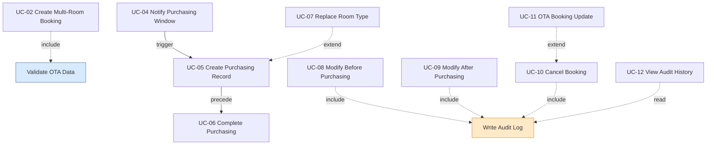

---

## 6. Mô hình dữ liệu (ERD)

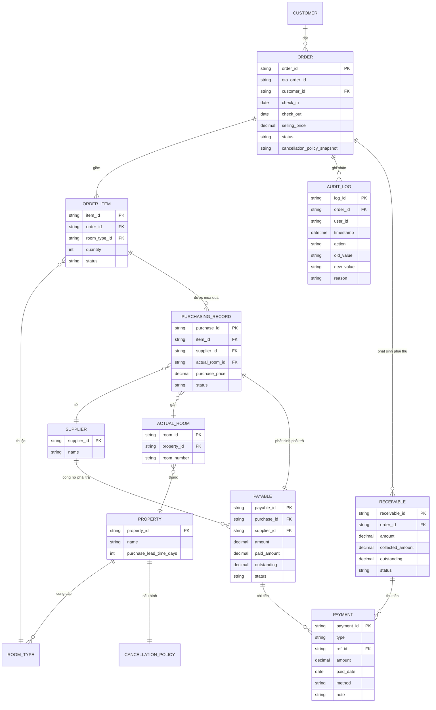

> **Ghi chú hạch toán:** Theo quyết định nghiệp vụ, kế toán **hạch toán theo Purchasing Record** (xem [QĐ-02](#11-quyết-định-nghiệp-vụ-đã-chốt)). Do đó mỗi `PURCHASING_RECORD` sinh đúng **một** bản ghi `PAYABLE` (công nợ phải trả supplier); mỗi `ORDER` sinh `RECEIVABLE` (công nợ phải thu từ OTA/khách). `PAYMENT.type` phân biệt `RECEIPT` (thu) và `DISBURSEMENT` (chi); `ref_id` trỏ tới `RECEIVABLE` hoặc `PAYABLE` tương ứng.

---

## 7. Đặc tả Use Case - Booking & Purchasing

---

### UC-01 - Create Single Room Booking

| Trường | Mô tả |
| --- | --- |
| **Use Case ID** | UC-01 |
| **Tên Use Case** | Tạo booking đơn phòng |
| **Primary Actor** | OTA Integration |
| **Stakeholders** | Operation Staff, Accounting Staff |
| **Trigger** | OTA gửi booking mới (1 phòng) |
| **Preconditions** | OTA booking hợp lệ; dữ liệu khách & property tồn tại |
| **Postconditions** | Booking được tạo ở trạng thái `Pending Purchase` |
| **Priority** | High |
| **Tần suất** | Cao |

#### Main Flow

| Step | Action |
| --- | --- |
| 1 | OTA gửi payload booking |
| 2 | CMS validate dữ liệu (khách, ngày, giá, room type) |
| 3 | CMS tạo `Order` |
| 4 | CMS tạo `Order Item` (quantity = 1) |
| 5 | CMS chuyển trạng thái sang `Pending Purchase` |
| 6 | CMS ghi audit log "Create Booking" |

#### Alternative Flow

| ID | Điều kiện | Xử lý |
| --- | --- | --- |
| A1 | Booking trùng OTA Order ID | Bỏ qua tạo mới, ghi nhận là duplicate |

#### Exception Flow

| ID | Điều kiện | Xử lý |
| --- | --- | --- |
| E1 | Dữ liệu OTA không hợp lệ | Từ chối tạo, đẩy vào hàng đợi lỗi để Operation kiểm tra |

#### Business Rules

| Rule ID | Mô tả |
| --- | --- |
| BR-01 | Mỗi booking phải có ít nhất 1 Order Item |

---

### UC-02 - Create Multi-Room Booking

| Trường | Mô tả |
| --- | --- |
| **Use Case ID** | UC-02 |
| **Tên Use Case** | Tạo booking nhiều phòng |
| **Primary Actor** | OTA Integration |
| **Stakeholders** | Operation Staff, Purchasing Staff |
| **Trigger** | OTA gửi booking nhiều phòng / nhiều room type |
| **Preconditions** | OTA booking hợp lệ |
| **Postconditions** | Một Order duy nhất chứa nhiều Order Item được tạo |
| **Priority** | Critical |
| **Tần suất** | Cao |

#### Main Flow

| Step | Action |
| --- | --- |
| 1 | OTA gửi booking (ví dụ: Studio × 2, 1BR × 1) |
| 2 | CMS validate dữ liệu |
| 3 | CMS tạo **một** `Order` duy nhất |
| 4 | CMS tạo các `Order Item` tương ứng từng room type |
| 5 | CMS lưu `quantity` cho từng room type |
| 6 | CMS chuyển trạng thái sang `Pending Purchase` |
| 7 | CMS hiển thị booking trên màn hình vận hành & ghi audit log |

#### Sequence Diagram

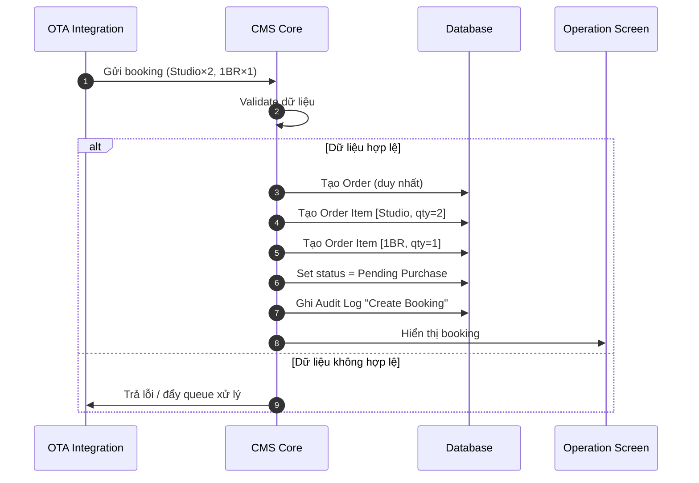

#### Business Rules

| Rule ID | Mô tả |
| --- | --- |
| BR-02 | Một booking có thể có nhiều room type |
| BR-03 | Một room type có thể có quantity > 1 |
| BR-04 | Toàn bộ room thuộc cùng booking nằm trong **cùng một Order** |

---

### UC-03 - View Booking Details

| Trường | Mô tả |
| --- | --- |
| **Use Case ID** | UC-03 |
| **Tên Use Case** | Xem chi tiết booking |
| **Primary Actor** | Operation Staff |
| **Stakeholders** | Accounting Staff, Purchasing Staff |
| **Trigger** | Người dùng mở một booking |
| **Preconditions** | Booking tồn tại; người dùng có quyền truy cập |
| **Postconditions** | Hiển thị đầy đủ dữ liệu booking |
| **Priority** | Medium |

#### Main Flow

| Step | Action |
| --- | --- |
| 1 | Người dùng chọn booking từ danh sách |
| 2 | CMS tải dữ liệu booking & các quan hệ liên quan |
| 3 | CMS hiển thị màn hình chi tiết |

#### Thông tin hiển thị

| Nhóm | Nội dung |
| --- | --- |
| Booking Information | Order ID, trạng thái, check-in/out, giá bán |
| Customer Information | Tên, liên hệ |
| OTA Information | OTA Order ID, nguồn OTA |
| Order Items | Room type, quantity, trạng thái từng item |
| Purchasing Records | Supplier, giá mua, actual room |
| Assigned Rooms | Danh sách phòng thực tế đã gán |
| Audit Logs | Timeline thay đổi |

---

### UC-04 - Notify Purchasing Window

| Trường | Mô tả |
| --- | --- |
| **Use Case ID** | UC-04 |
| **Tên Use Case** | Thông báo cửa sổ purchasing |
| **Primary Actor** | System (Scheduler) |
| **Stakeholders** | Purchasing Staff |
| **Trigger** | Daily scheduler (chạy định kỳ hằng ngày) |
| **Preconditions** | Property có cấu hình purchasing lead time |
| **Postconditions** | Notification được tạo cho các booking đến hạn |
| **Priority** | High |

#### Main Flow

| Step | Action |
| --- | --- |
| 1 | System quét các booking ở trạng thái `Pending Purchase` |
| 2 | Tính số ngày còn lại tới check-in |
| 3 | So sánh với `purchase_lead_time` của property |
| 4 | Nếu tới ngưỡng → tạo notification cho Purchasing Staff |
| 5 | Ghi nhận đã gửi notification (tránh trùng) |

#### Activity Diagram

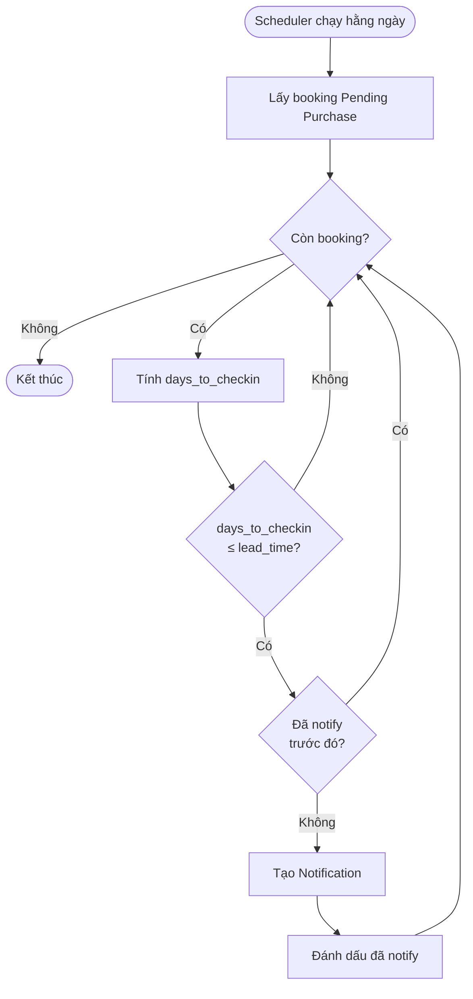

#### Business Rules

| Rule ID | Mô tả |
| --- | --- |
| BR-05 | Lead time được cấu hình ở cấp Property |
| BR-06 | CMS chỉ notify, **không tự động** purchasing |

---

### UC-05 - Create Purchasing Record

| Trường | Mô tả |
| --- | --- |
| **Use Case ID** | UC-05 |
| **Tên Use Case** | Tạo bản ghi purchasing |
| **Primary Actor** | Purchasing Staff |
| **Stakeholders** | Accounting Staff, Operation Staff |
| **Trigger** | Người dùng thực hiện purchasing cho một phòng |
| **Preconditions** | Booking ở trạng thái `Pending Purchase` / `Partially Purchased` |
| **Postconditions** | Purchasing Record được tạo & gán phòng thực tế |
| **Priority** | Critical |

#### Main Flow

| Step | Action |
| --- | --- |
| 1 | Chọn `Order Item` cần mua |
| 2 | Chọn `Supplier` |
| 3 | Nhập giá mua (purchase price) |
| 4 | Chọn `Property` |
| 5 | Chọn `Actual Room` |
| 6 | Lưu `Purchasing Record` |
| 7 | Cập nhật trạng thái Order Item / Order (`Partially Purchased`) & ghi audit |

#### Alternative Flow

| ID | Điều kiện | Xử lý |
| --- | --- | --- |
| A1 | Không tìm được phòng đúng room type | Chuyển sang **UC-07 Replace Room Type** |
| A2 | Mua từ nhiều supplier cho cùng room type | Tạo nhiều Purchasing Record riêng |

#### Business Rules

| Rule ID | Mô tả |
| --- | --- |
| BR-07 | Một booking có thể có nhiều supplier |
| BR-08 | Một supplier có thể cung cấp nhiều room |
| BR-09 | Actual Room được xác định **sau khi** mua |

---

### UC-06 - Complete Purchasing

| Trường | Mô tả |
| --- | --- |
| **Use Case ID** | UC-06 |
| **Tên Use Case** | Hoàn tất purchasing |
| **Primary Actor** | Purchasing Staff |
| **Stakeholders** | Operation Staff, Accounting Staff |
| **Trigger** | Đã mua đủ toàn bộ phòng trong booking |
| **Preconditions** | Tất cả room đã có Purchasing Record, supplier & actual room |
| **Postconditions** | Booking chuyển trạng thái `Purchased` |
| **Priority** | Critical |

#### Main Flow

| Step | Action |
| --- | --- |
| 1 | Hệ thống kiểm tra tất cả Order Item của booking |
| 2 | Xác nhận mọi phòng đã có Purchasing Record + Supplier + Actual Room |
| 3 | Purchasing Staff xác nhận hoàn tất |
| 4 | CMS cập nhật trạng thái `Purchased` & ghi audit |

#### Exception Flow

| ID | Điều kiện | Xử lý |
| --- | --- | --- |
| E1 | Còn phòng chưa có Purchasing Record | Chặn hoàn tất, hiển thị danh sách phòng thiếu |

#### Business Rules

| Rule ID | Mô tả |
| --- | --- |
| BR-10 | Purchasing chỉ hoàn tất khi **toàn bộ** room đã được mua, gán supplier & gán actual room |
| BR-11 | Không cho phép `Purchased` khi còn room thiếu |

---

### UC-07 - Replace Room Type

| Trường | Mô tả |
| --- | --- |
| **Use Case ID** | UC-07 |
| **Tên Use Case** | Thay đổi room type |
| **Primary Actor** | Purchasing Staff |
| **Stakeholders** | Operation Staff |
| **Trigger** | Không mua được room đúng yêu cầu khách |
| **Preconditions** | Booking chưa `Purchased` |
| **Postconditions** | Booking được cập nhật room type & lưu audit |
| **Priority** | High |

#### Main Flow

| Step | Action |
| --- | --- |
| 1 | Chọn room/Order Item cần thay |
| 2 | Chọn room type mới (ví dụ: Studio → 2BR) |
| 3 | Nhập **lý do** thay đổi (bắt buộc) |
| 4 | Xác nhận thay đổi |
| 5 | Ghi audit log "Replace Room Type" (old/new value + reason) |

#### Business Rules

| Rule ID | Mô tả |
| --- | --- |
| BR-12 | Bắt buộc nhập lý do khi replace |
| BR-13 | Không được xóa lịch sử - chỉ thêm bản ghi mới |

---

### UC-08 - Modify Booking Before Purchasing

| Trường | Mô tả |
| --- | --- |
| **Use Case ID** | UC-08 |
| **Tên Use Case** | Chỉnh sửa booking trước purchasing |
| **Primary Actor** | Operation Staff |
| **Stakeholders** | Purchasing Staff |
| **Trigger** | Người dùng chỉnh sửa booking |
| **Preconditions** | Booking chưa `Purchased` |
| **Postconditions** | Booking được cập nhật & ghi audit |
| **Priority** | High |

#### Allowed Actions

| Hành động | Cho phép |
| --- | --- |
| Tăng số lượng phòng | Cho phép |
| Giảm số lượng phòng | Cho phép |
| Đổi room type | Cho phép |
| Đổi ngày check-in | Cho phép |
| Đổi ngày check-out | Cho phép |

#### Main Flow

| Step | Action |
| --- | --- |
| 1 | Người dùng mở booking & chọn chỉnh sửa |
| 2 | Thực hiện thay đổi (quantity / room type / ngày) |
| 3 | CMS validate ràng buộc nghiệp vụ |
| 4 | Lưu thay đổi & ghi audit log (old/new value) |

#### Business Rules

| Rule ID | Mô tả |
| --- | --- |
| BR-26 | Mọi thay đổi phải được audit (áp dụng chung) |

---

### UC-09 - Modify Booking After Purchasing

| Trường | Mô tả |
| --- | --- |
| **Use Case ID** | UC-09 |
| **Tên Use Case** | Chỉnh sửa booking sau purchasing |
| **Primary Actor** | Operation Staff |
| **Stakeholders** | Accounting Staff |
| **Trigger** | Người dùng chỉnh sửa booking đã `Purchased` |
| **Preconditions** | Booking ở trạng thái `Purchased` |
| **Postconditions** | Booking được cập nhật (giảm quantity) hoặc thao tác bị từ chối |
| **Priority** | High |

#### Allowed / Restricted Actions

| Hành động | Sau Purchasing |
| --- | --- |
| Tăng số lượng phòng | Không cho phép |
| Đổi room type | Không cho phép |
| Đổi ngày check-in | Không cho phép |
| Đổi ngày check-out | Không cho phép |
| Giảm số lượng phòng | Cho phép (có thể bị charge từ 50% đến 100% tùy vào đã mua hay chưa) |

#### Decision Flow

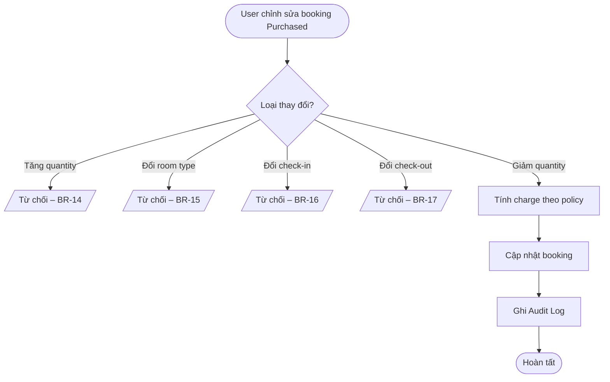

#### Business Rules

| Rule ID | Mô tả |
| --- | --- |
| BR-14 | Không cho tăng quantity |
| BR-15 | Không cho đổi room type |
| BR-16 | Không cho đổi check-in date |
| BR-17 | Không cho đổi check-out date |
| BR-18 | Cho phép giảm quantity |
| BR-19 | Giảm quantity có thể bị charge (tới 100% theo policy) |
| BR-27 | Không cho phép Partial Cancellation sau khi Purchased (QĐ-01) |
| BR-30 | Hiện chưa áp dụng workflow phê duyệt cho thay đổi sau Purchased (QĐ-04) |

---

### UC-10 - Cancel Booking

| Trường | Mô tả |
| --- | --- |
| **Use Case ID** | UC-10 |
| **Tên Use Case** | Hủy booking |
| **Primary Actor** | OTA Integration, Operation Staff |
| **Stakeholders** | Accounting Staff, Purchasing Staff |
| **Trigger** | Khách hủy booking / OTA gửi yêu cầu hủy |
| **Preconditions** | Booking tồn tại & chưa `Cancelled` |
| **Postconditions** | Booking chuyển `Cancelled`; cancellation fee được tính |
| **Priority** | High |

#### Main Flow

| Step | Action |
| --- | --- |
| 1 | Nhận yêu cầu hủy |
| 2 | Xác định cancellation policy của property |
| 3 | Tính cancellation fee theo policy & trạng thái purchasing |
| 4 | Cập nhật trạng thái `Cancelled` (soft delete) |
| 5 | Ghi audit log "Cancellation" |

#### Sequence Diagram

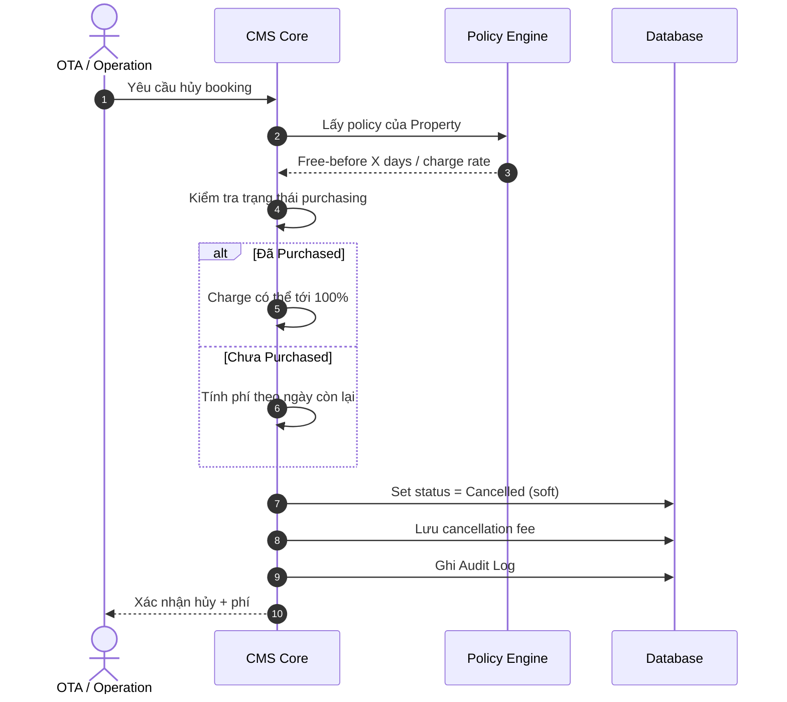

#### Business Rules

| Rule ID | Mô tả |
| --- | --- |
| BR-20 | Cancellation policy cấu hình theo Property (không theo room type) |
| BR-21 | Có thể charge đến 100% sau khi purchasing hoàn tất |
| BR-27 | Không cho phép Partial Cancellation sau khi Purchased (QĐ-01) |

---

### UC-11 - OTA Booking Update

| Trường | Mô tả |
| --- | --- |
| **Use Case ID** | UC-11 |
| **Tên Use Case** | Xử lý update từ OTA |
| **Primary Actor** | OTA Integration |
| **Stakeholders** | Operation Staff |
| **Trigger** | OTA gửi update cho booking đã tồn tại |
| **Preconditions** | Booking tồn tại |
| **Postconditions** | Update được đưa vào queue chờ user quyết định |
| **Priority** | Medium |

#### Main Flow

| Step | Action |
| --- | --- |
| 1 | Nhận OTA update |
| 2 | Kiểm tra trạng thái booking hiện tại |
| 3 | Đưa update vào queue xử lý (không tự áp dụng) |
| 4 | User quyết định approve / reject |
| 5 | Ghi audit log kết quả xử lý |

#### Alternative Flow

| ID | Điều kiện | Xử lý |
| --- | --- | --- |
| A1 | Update là yêu cầu hủy | Chuyển sang **UC-10 Cancel Booking** |
| A2 | Booking đã `Purchased` | Thường reject hoặc xử lý như cancellation |

#### Business Rules

| Rule ID | Mô tả |
| --- | --- |
| BR-22 | Không tự động update booking đã `Purchased` |
| BR-23 | OTA update thường được xử lý như cancellation hoặc reject |

---

### UC-12 - View Audit History

| Trường | Mô tả |
| --- | --- |
| **Use Case ID** | UC-12 |
| **Tên Use Case** | Xem lịch sử audit |
| **Primary Actor** | Operation Staff |
| **Stakeholders** | Accounting Staff, Management |
| **Trigger** | Người dùng mở lịch sử thay đổi của booking |
| **Preconditions** | Booking tồn tại |
| **Postconditions** | Hiển thị timeline thay đổi đầy đủ |
| **Priority** | Medium |

#### Audit Events được ghi nhận

| Sự kiện | Sự kiện |
| --- | --- |
| Create Booking | Replace Room Type |
| Modify Booking | Purchasing Update |
| Add Room | Supplier Change |
| Remove Room | Cancellation |
| Status Change | - |

#### Thông tin Audit (mỗi bản ghi)

| Trường | Mô tả |
| --- | --- |
| User | Người thực hiện thay đổi |
| Timestamp | Thời điểm thay đổi |
| Action | Loại hành động |
| Old Value | Giá trị cũ |
| New Value | Giá trị mới |
| Reason | Lý do (nếu áp dụng) |

#### Business Rules

| Rule ID | Mô tả |
| --- | --- |
| BR-24 | Không cho hard delete booking |
| BR-25 | Không cho hard delete purchasing records |
| BR-26 | Mọi thay đổi phải được audit |

---

## 8. Đặc tả Use Case - Kế toán & Công nợ

### 8.1. Mô hình kế toán

Kế toán theo dõi **3 chỉ tiêu** trên mỗi booking:

| Chỉ tiêu | Nguồn dữ liệu | Diễn giải |
| --- | --- | --- |
| **Doanh thu (Revenue)** | `ORDER.selling_price` | Giá bán cho khách qua OTA → công nợ **phải thu**. |
| **Chi phí (Cost)** | Tổng `PURCHASING_RECORD.purchase_price` | Giá mua phòng từ supplier → công nợ **phải trả**. |
| **Lợi nhuận (Margin)** | `Revenue − Cost` | Phần chênh lệch công ty hưởng. |

Hai loại công nợ:

- **Công nợ phải thu (AR – Receivable):** công ty thu từ OTA/khách, gắn với `ORDER`.
- **Công nợ phải trả (AP – Payable):** công ty trả cho supplier, gắn với **từng** `PURCHASING_RECORD`.

> **Nguyên tắc hạch toán:** Kế toán **hạch toán theo Purchasing Record**, không theo Booking (xem [QĐ-02](#11-quyết-định-nghiệp-vụ-đã-chốt)). Mỗi Purchasing Record là một đơn vị công nợ phải trả độc lập, cho phép một booking có nhiều supplier với nhiều dòng công nợ riêng biệt.

### 8.2. Use Case Diagram - Phân hệ Kế toán

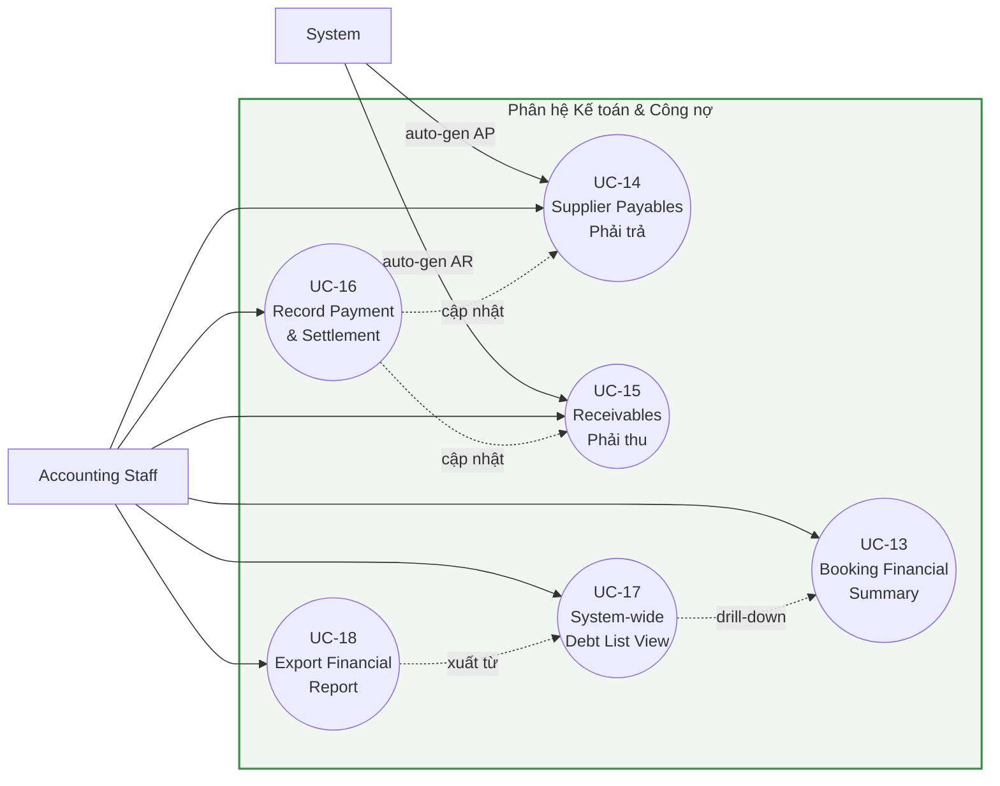

### 8.3. Vòng đời một dòng công nợ (AR/AP)

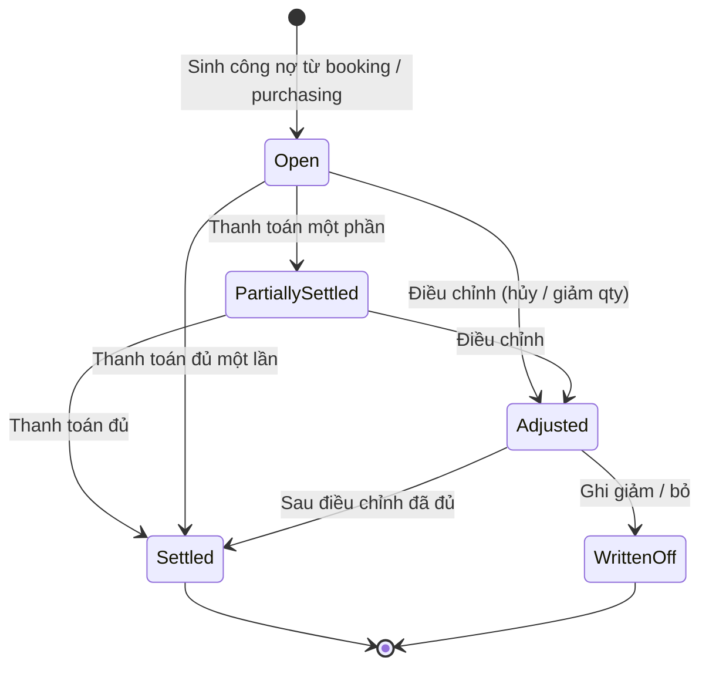

---

### UC-13 - View Booking Financial Summary

| Trường | Mô tả |
| --- | --- |
| **Use Case ID** | UC-13 |
| **Tên Use Case** | Xem tổng quan tài chính của booking |
| **Primary Actor** | Accounting Staff |
| **Stakeholders** | Operation Staff, Management |
| **Trigger** | Người dùng mở tab "Tài chính" của một booking |
| **Preconditions** | Booking tồn tại; có ít nhất 1 Purchasing Record để tính chi phí |
| **Postconditions** | Hiển thị doanh thu, chi phí, margin & trạng thái công nợ |
| **Priority** | High |

#### Main Flow

| Step | Action |
| --- | --- |
| 1 | Người dùng mở tab Tài chính của booking |
| 2 | CMS lấy `selling_price` (doanh thu / phải thu) |
| 3 | CMS tổng hợp `purchase_price` từ tất cả Purchasing Record (chi phí / phải trả) |
| 4 | CMS tính Margin = Doanh thu − Chi phí |
| 5 | CMS hiển thị breakdown theo từng supplier & trạng thái thanh toán |

#### Thông tin hiển thị

| Nhóm | Nội dung |
| --- | --- |
| Doanh thu | Giá bán, công nợ phải thu, đã thu, còn lại |
| Chi phí | Tổng giá mua, danh sách Purchasing Record theo supplier |
| Margin | Lợi nhuận tuyệt đối & tỷ suất (%) |
| Công nợ | Trạng thái AR/AP (Open / Partially Settled / Settled) |
| Điều chỉnh | Phí hủy, charge giảm quantity (nếu có) |

#### Business Rules

| Rule ID | Mô tả |
| --- | --- |
| BR-28 | Kế toán hạch toán theo Purchasing Record, không theo Booking |
| BR-31 | Chi phí booking = tổng giá mua của các Purchasing Record |

---

### UC-14 - Track Supplier Payables

| Trường | Mô tả |
| --- | --- |
| **Use Case ID** | UC-14 |
| **Tên Use Case** | Theo dõi công nợ phải trả Supplier |
| **Primary Actor** | Accounting Staff |
| **Secondary Actor** | System (tự sinh bút toán AP) |
| **Stakeholders** | Purchasing Staff, Management |
| **Trigger** | Purchasing Record được tạo / người dùng mở danh sách phải trả |
| **Preconditions** | Tồn tại ít nhất 1 Purchasing Record |
| **Postconditions** | Mỗi Purchasing Record có một bản ghi Payable được theo dõi |
| **Priority** | Critical |

#### Main Flow

| Step | Action |
| --- | --- |
| 1 | System tự sinh `Payable` khi Purchasing Record được tạo (amount = purchase_price) |
| 2 | Accounting mở danh sách công nợ phải trả, lọc theo supplier / property / kỳ |
| 3 | CMS hiển thị: supplier, booking, giá mua, đã trả, còn lại, trạng thái |
| 4 | Accounting đối chiếu với hóa đơn/chứng từ supplier |
| 5 | Khi thanh toán → chuyển sang **UC-16 Record Payment & Settlement** |

#### Business Rules

| Rule ID | Mô tả |
| --- | --- |
| BR-29 | Không đổi Supplier của Purchasing Record sau khi Purchased nếu đơn không phát sinh thay đổi |
| BR-32 | Mỗi Purchasing Record sinh đúng một bản ghi Payable |
| BR-34 | Một Payable chỉ `Settled` khi outstanding = 0 |

---

### UC-15 - Track Receivables

| Trường | Mô tả |
| --- | --- |
| **Use Case ID** | UC-15 |
| **Tên Use Case** | Theo dõi công nợ phải thu (OTA/Khách) |
| **Primary Actor** | Accounting Staff |
| **Secondary Actor** | System (tự sinh bút toán AR) |
| **Stakeholders** | Operation Staff, Management |
| **Trigger** | Booking được tạo / người dùng mở danh sách phải thu |
| **Preconditions** | Booking tồn tại với giá bán hợp lệ |
| **Postconditions** | Mỗi Order có bản ghi Receivable được theo dõi |
| **Priority** | High |

#### Main Flow

| Step | Action |
| --- | --- |
| 1 | System sinh `Receivable` từ `selling_price` của Order |
| 2 | Accounting mở danh sách phải thu, lọc theo OTA / kỳ / trạng thái |
| 3 | CMS hiển thị: booking, OTA, số phải thu, đã thu, còn lại |
| 4 | Khi nhận tiền từ OTA → **UC-16 Record Payment & Settlement** |

#### Alternative Flow

| ID | Điều kiện | Xử lý |
| --- | --- | --- |
| A1 | Booking bị hủy có phí hủy | CMS điều chỉnh Receivable theo cancellation fee (BR-35) |
| A2 | Giảm quantity sau Purchased có charge | Ghi nhận khoản charge vào Receivable |

#### Business Rules

| Rule ID | Mô tả |
| --- | --- |
| BR-33 | Mỗi Order sinh Receivable theo giá bán |
| BR-35 | Phí hủy / charge giảm quantity được hạch toán vào công nợ phải thu |

---

### UC-16 - Record Payment & Settlement

| Trường | Mô tả |
| --- | --- |
| **Use Case ID** | UC-16 |
| **Tên Use Case** | Ghi nhận thanh toán & đối soát công nợ |
| **Primary Actor** | Accounting Staff |
| **Stakeholders** | Supplier, OTA, Management |
| **Trigger** | Phát sinh thu tiền từ OTA hoặc chi tiền cho supplier |
| **Preconditions** | Tồn tại công nợ AR/AP ở trạng thái `Open` hoặc `Partially Settled` |
| **Postconditions** | Số dư công nợ được cập nhật; ghi audit log |
| **Priority** | High |

#### Main Flow

| Step | Action |
| --- | --- |
| 1 | Chọn dòng công nợ (Receivable / Payable) |
| 2 | Nhập số tiền thanh toán, ngày, phương thức, ghi chú |
| 3 | CMS tạo bản ghi `Payment` (RECEIPT / DISBURSEMENT) |
| 4 | CMS cập nhật `outstanding` và trạng thái công nợ |
| 5 | CMS ghi audit log "Payment Recorded" |

#### Sequence Diagram

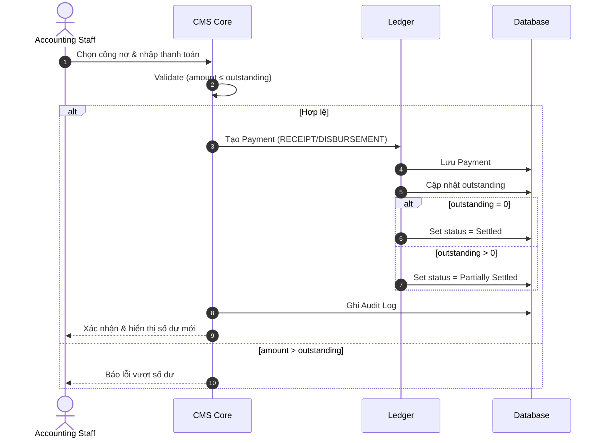

#### Business Rules

| Rule ID | Mô tả |
| --- | --- |
| BR-36 | Số tiền thanh toán không vượt quá outstanding của công nợ |
| BR-37 | Không cho hard delete bút toán/thanh toán; chỉ điều chỉnh bằng bút toán mới |

---

### UC-17 - System-wide Debt Tracking (List View)

| Trường | Mô tả |
| --- | --- |
| **Use Case ID** | UC-17 |
| **Tên Use Case** | Màn hình theo dõi công nợ toàn hệ thống (List View) |
| **Primary Actor** | Accounting Staff |
| **Stakeholders** | Management, Operation Staff |
| **Trigger** | Người dùng mở màn hình "Công nợ" trên menu kế toán |
| **Preconditions** | Người dùng có quyền truy cập phân hệ kế toán |
| **Postconditions** | Hiển thị danh sách công nợ toàn hệ thống kèm tổng hợp |
| **Priority** | Critical |

> Đây là **màn hình riêng** dành cho kế toán, tổng hợp công nợ AR + AP của **toàn bộ hệ thống** dưới dạng list view - không phụ thuộc vào việc mở từng booking.

#### Main Flow

| Step | Action |
| --- | --- |
| 1 | Người dùng mở màn hình Công nợ |
| 2 | CMS tải toàn bộ dòng công nợ AR/AP (phân trang) |
| 3 | Người dùng áp dụng bộ lọc & sắp xếp |
| 4 | CMS hiển thị danh sách + thẻ KPI tổng hợp |
| 5 | Người dùng có thể drill-down vào booking (UC-13) hoặc xuất báo cáo (UC-18) |

#### Bộ lọc (Filters)

| Filter | Giá trị |
| --- | --- |
| Loại công nợ | Phải thu (AR) / Phải trả (AP) / Tất cả |
| Trạng thái | Open / Partially Settled / Settled / Overdue |
| Supplier | Chọn 1 hoặc nhiều supplier |
| OTA | Agoda / Trip.com / Booking.com / … |
| Property | Chọn property |
| Khoảng thời gian | Theo ngày tạo / ngày đến hạn / check-in |
| Quá hạn | Chỉ hiển thị công nợ quá hạn |

#### Cột hiển thị (Columns)

| Cột | Mô tả |
| --- | --- |
| Loại | AR / AP |
| Booking ID | Mã booking liên quan |
| OTA Order ID | Mã đơn OTA |
| Đối tác | OTA (với AR) / Supplier (với AP) |
| Property | Tòa nhà liên quan |
| Check-in / out | Ngày lưu trú |
| Số tiền | Tổng công nợ |
| Đã thanh toán | Đã thu / đã trả |
| Còn lại (Outstanding) | Số dư còn lại |
| Đến hạn | Ngày đến hạn thanh toán |
| Trạng thái | Open / Partially Settled / Settled / Overdue |

#### Thẻ tổng hợp (KPI Cards)

| KPI | Diễn giải |
| --- | --- |
| Tổng phải thu | Σ outstanding của AR |
| Tổng phải trả | Σ outstanding của AP |
| Net (AR − AP) | Chênh lệch ròng |
| Công nợ quá hạn | Σ outstanding các dòng Overdue |

#### Bố cục màn hình (Wireframe)

```text
┌───────────────────────────────────────────────────────────────────────────┐
│  CÔNG NỢ TOÀN HỆ THỐNG                              [ Xuất báo cáo ▼ ]      │
├───────────────────────────────────────────────────────────────────────────┤
│  Phải thu: 1,250,000,000   Phải trả: 880,000,000   Net: 370,000,000        │
│  Quá hạn: 95,000,000                                                        │
├───────────────────────────────────────────────────────────────────────────┤
│ [Loại▼] [Trạng thái▼] [Supplier▼] [OTA▼] [Property▼] [Từ ngày–Đến ngày] 🔍 │
├──────┬───────────┬──────────┬──────────┬──────────┬──────────┬─────────────┤
│ Loại │ Booking   │ Đối tác  │ Số tiền  │ Đã TT    │ Còn lại  │ Trạng thái  │
├──────┼───────────┼──────────┼──────────┼──────────┼──────────┼─────────────┤
│ AP   │ #123-R1   │ Supp A   │  5,000k  │  0       │  5,000k  │ Open        │
│ AP   │ #123-R2   │ Supp B   │  4,500k  │  4,500k  │  0       │ Settled     │
│ AR   │ #123      │ Agoda    │ 12,000k  │  6,000k  │  6,000k  │ Partial     │
│ AR   │ #145      │ Trip.com │  8,000k  │  0       │  8,000k  │ Overdue     │
└──────┴───────────┴──────────┴──────────┴──────────┴──────────┴─────────────┘
        ◀ 1 2 3 … ▶                                    Hiển thị 1–20 / 248
```

#### Activity Flow

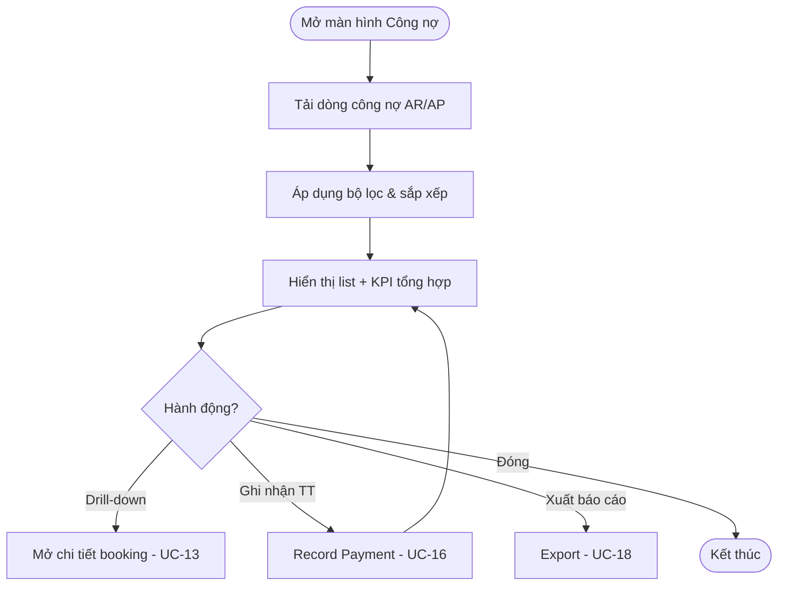

#### Business Rules

| Rule ID | Mô tả |
| --- | --- |
| BR-38 | List view tổng hợp công nợ AR + AP của toàn hệ thống |
| BR-39 | Công nợ quá ngày đến hạn mà outstanding > 0 → trạng thái `Overdue` |

---

### UC-18 - Export Financial / Debt Report

| Trường | Mô tả |
| --- | --- |
| **Use Case ID** | UC-18 |
| **Tên Use Case** | Xuất báo cáo công nợ / tài chính |
| **Primary Actor** | Accounting Staff |
| **Stakeholders** | Management |
| **Trigger** | Người dùng nhấn "Xuất báo cáo" |
| **Preconditions** | Có dữ liệu công nợ phù hợp bộ lọc hiện tại |
| **Postconditions** | File báo cáo được tạo & tải về |
| **Priority** | Medium |

#### Main Flow

| Step | Action |
| --- | --- |
| 1 | Người dùng giữ nguyên/điều chỉnh bộ lọc trên màn hình Công nợ |
| 2 | Chọn định dạng xuất (Excel / CSV / PDF) |
| 3 | CMS tổng hợp dữ liệu theo bộ lọc |
| 4 | CMS sinh file kèm dòng tổng hợp (subtotal/total) |
| 5 | Người dùng tải file về |

#### Business Rules

| Rule ID | Mô tả |
| --- | --- |
| BR-40 | Báo cáo xuất theo đúng bộ lọc đang áp dụng trên màn hình |

---

## 9. Order Status Lifecycle

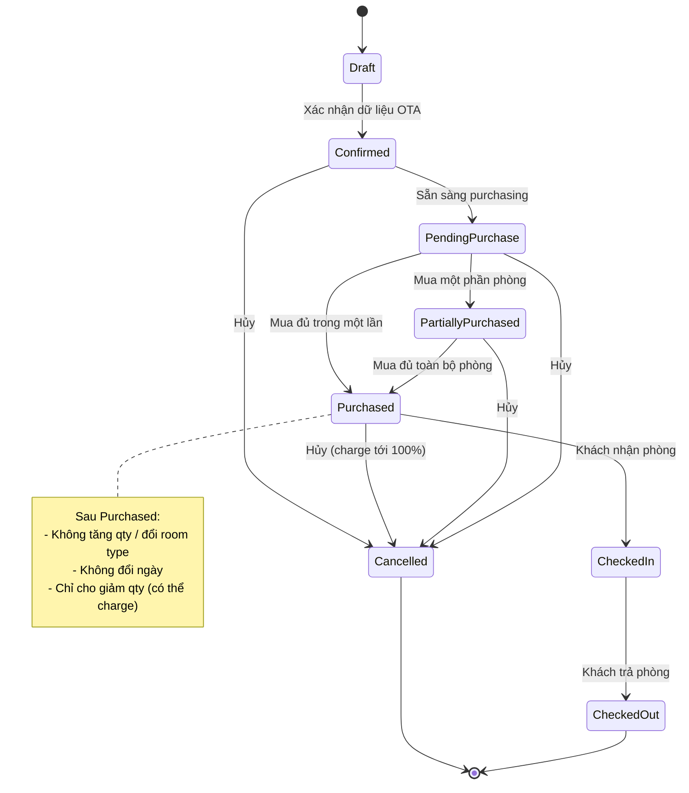

### 9.1. Bảng chuyển trạng thái

| Từ trạng thái | Tới trạng thái | Điều kiện / Use Case |
| --- | --- | --- |
| Draft | Confirmed | Validate OTA thành công |
| Confirmed | Pending Purchase | Booking sẵn sàng (UC-01/UC-02) |
| Pending Purchase | Partially Purchased | Tạo một phần Purchasing Record (UC-05) |
| Partially Purchased | Purchased | Hoàn tất toàn bộ purchasing (UC-06) |
| Purchased | Checked In | Khách nhận phòng |
| Checked In | Checked Out | Khách trả phòng |
| (bất kỳ active) | Cancelled | Hủy booking (UC-10) |

---

## 10. Tổng hợp Business Rules

| Rule ID | Use Case | Mô tả |
| --- | --- | --- |
| BR-01 | UC-01 | Mỗi booking phải có ít nhất 1 Order Item |
| BR-02 | UC-02 | Một booking có thể có nhiều room type |
| BR-03 | UC-02 | Một room type có thể có quantity > 1 |
| BR-04 | UC-02 | Toàn bộ room thuộc cùng booking nằm trong cùng một Order |
| BR-05 | UC-04 | Lead time được cấu hình ở cấp Property |
| BR-06 | UC-04 | CMS chỉ notify, không tự purchasing |
| BR-07 | UC-05 | Một booking có thể có nhiều supplier |
| BR-08 | UC-05 | Một supplier có thể cung cấp nhiều room |
| BR-09 | UC-05 | Actual Room được xác định sau khi mua |
| BR-10 | UC-06 | Purchasing chỉ hoàn tất khi toàn bộ room đã mua/gán đủ |
| BR-11 | UC-06 | Không cho phép Purchased khi còn room thiếu |
| BR-12 | UC-07 | Bắt buộc nhập lý do khi replace |
| BR-13 | UC-07 | Không được xóa lịch sử |
| BR-14 | UC-09 | Không cho tăng quantity sau purchasing |
| BR-15 | UC-09 | Không cho đổi room type sau purchasing |
| BR-16 | UC-09 | Không cho đổi check-in date sau purchasing |
| BR-17 | UC-09 | Không cho đổi check-out date sau purchasing |
| BR-18 | UC-09 | Cho phép giảm quantity sau purchasing |
| BR-19 | UC-09 | Giảm quantity có thể bị charge |
| BR-20 | UC-10 | Cancellation policy cấu hình theo Property |
| BR-21 | UC-10 | Có thể charge đến 100% sau khi purchasing |
| BR-22 | UC-11 | Không tự động update booking đã Purchased |
| BR-23 | UC-11 | OTA update xử lý như cancellation hoặc reject |
| BR-24 | UC-12 | Không cho hard delete booking |
| BR-25 | UC-12 | Không cho hard delete purchasing records |
| BR-26 | UC-08/09/12 | Mọi thay đổi phải được audit |
| BR-27 | UC-09/UC-10 | Không cho phép Partial Cancellation sau khi Purchased (QĐ-01) |
| BR-28 | UC-13/UC-14 | Kế toán hạch toán theo Purchasing Record, không theo Booking (QĐ-02) |
| BR-29 | UC-14 | Không đổi Supplier của Purchasing Record sau Purchased nếu đơn không phát sinh thay đổi (QĐ-03) |
| BR-30 | UC-09 | Chưa áp dụng workflow phê duyệt khi thay đổi booking sau Purchased (QĐ-04) |
| BR-31 | UC-13 | Chi phí booking = tổng giá mua của các Purchasing Record |
| BR-32 | UC-14 | Mỗi Purchasing Record sinh đúng một bản ghi Payable |
| BR-33 | UC-15 | Mỗi Order sinh Receivable theo giá bán |
| BR-34 | UC-14 | Một Payable chỉ `Settled` khi outstanding = 0 |
| BR-35 | UC-15 | Phí hủy / charge giảm quantity được hạch toán vào công nợ phải thu |
| BR-36 | UC-16 | Số tiền thanh toán không vượt quá outstanding |
| BR-37 | UC-16 | Không cho hard delete bút toán/thanh toán; điều chỉnh bằng bút toán mới |
| BR-38 | UC-17 | List view tổng hợp công nợ AR + AP toàn hệ thống |
| BR-39 | UC-17 | Outstanding > 0 quá ngày đến hạn → trạng thái `Overdue` |
| BR-40 | UC-18 | Báo cáo xuất theo đúng bộ lọc đang áp dụng |

---

## 11. Quyết định nghiệp vụ đã chốt

Các vấn đề trước đây còn để mở (Open Questions) đã được **chốt** và **tích hợp trực tiếp** vào các use case & business rule liên quan. Bảng dưới đây dùng để truy vết quyết định → nơi áp dụng.

| Mã QĐ | Vấn đề | Quyết định | Áp dụng tại |
| --- | --- | --- | --- |
| **QĐ-01** | Có cho phép Partial Cancellation sau khi Purchased không? | **Không** | UC-09, UC-10 → BR-27 |
| **QĐ-02** | Kế toán hạch toán theo Booking hay Purchasing Record? | **Theo Purchasing Record** | UC-13, UC-14 → BR-28; ERD (PAYABLE/RECEIVABLE) |
| **QĐ-03** | Purchasing Record có được đổi Supplier sau Purchased không? | **Không, nếu đơn không phát sinh thay đổi** | UC-14 → BR-29 |
| **QĐ-04** | Có cần workflow phê duyệt khi thay đổi booking sau Purchased không? | **Hiện tại chưa** | UC-09 → BR-30 (ghi nhận cho giai đoạn sau) |

---

> **Ghi chú thiết kế:** Hệ thống phải hỗ trợ mở rộng - không giới hạn số phòng mỗi room type, không giới hạn số supplier, và không phụ thuộc vào cấu trúc hiện tại của OTA. Mọi mở rộng quy mô kinh doanh trong tương lai không được yêu cầu thay đổi data model cốt lõi (Booking → Order Item → Purchasing Record → Actual Room).

---

## Phụ lục A - Ghi chú khảo sát yêu cầu

> Phụ lục này ghi lại các phát hiện trong quá trình trao đổi yêu cầu (requirement discovery) và **truy vết** mỗi phát hiện tới use case / business rule / quyết định tương ứng trong tài liệu chính.

### Bảng truy vết tổng hợp

| Mục | Phát hiện | Truy vết |
| --- | --- | --- |
| A.1 | "Đơn nhiều căn" = một booking chứa nhiều room | UC-02, BR-02→BR-04 |
| A.2 | Loại bỏ thao tác copy thủ công của Lark Base | §1 Giới thiệu, UC-02 |
| A.3 | Purchasing theo Purchase Lead Time, không tự động | UC-04, BR-05, BR-06 |
| A.4 | Một booking mua từ nhiều supplier | UC-05, BR-07, BR-08; UC-14 |
| A.5 | Khách đặt room type, mua room thực tế | UC-05, BR-09; ERD |
| A.6 | Cho phép thay thế room type khi không mua được | UC-07, BR-12, BR-13 |
| A.7 | Audit log, không hard delete | UC-12, BR-24→BR-26 |
| A.8 | Cancellation policy ở cấp Property | UC-10, BR-20 |
| A.9 | Giới hạn chỉnh sửa sau purchasing | UC-09, BR-14→BR-19, BR-27 |
| A.10 | KPI không bị ảnh hưởng bởi booking nhiều room | Ghi chú phạm vi (xem A.10) |
| A.11 | OTA update xử lý như hủy / từ chối | UC-11, BR-22, BR-23 |
| A.12 | Không giới hạn số room/supplier - scalable | §2.3, Ghi chú thiết kế |

---

### A.1. Làm rõ Multi-Room Booking

Ban đầu xuất hiện khái niệm **"đơn nhiều căn"**. Sau khi trao đổi với người dùng, xác nhận:

- "Đơn nhiều căn" thực chất là **một booking chứa nhiều room**.
- Ví dụ: Studio × 2, 1BR × 1.
- Booking vẫn là **một Order duy nhất** → CMS không cần tạo nhiều booking riêng biệt.
- Booking sẽ chứa nhiều **room requests** (Order Item).

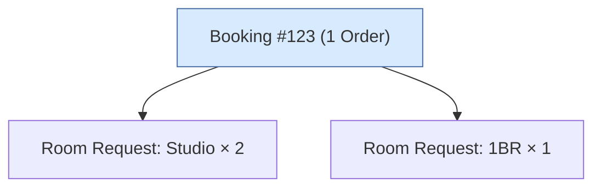

> **Truy vết:** UC-02 Create Multi-Room Booking; BR-02 (nhiều room type), BR-03 (quantity > 1), BR-04 (cùng một Order).

---

### A.2. Quy trình hiện tại trên Lark Base

Hiện tại dữ liệu được quản lý trên **Lark Base**. Khi booking có nhiều room:

- Nhân viên phải **copy record thủ công**.
- Các record có phần lớn dữ liệu giống nhau.
- Khác biệt chủ yếu nằm ở thông tin **purchasing**.

Mục tiêu của CMS:

- Loại bỏ thao tác copy thủ công.
- Tự động quản lý room requests và purchasing records.

> **Truy vết:** §1 Giới thiệu (bài toán cốt lõi); UC-02 tự động tạo Order Items.

---

### A.3. Purchasing Workflow

Purchasing **không** diễn ra ngay khi nhận booking. Mỗi Property được cấu hình **Purchase Lead Time** (ví dụ: 3 / 5 / 7 ngày).

Trước ngày check-in N ngày:

- Hệ thống gửi **notification**.
- Nhân viên purchasing thực hiện xử lý.
- CMS **không** tự động purchasing.

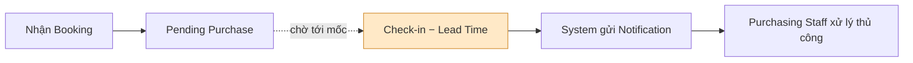

> **Truy vết:** UC-04 Notify Purchasing Window; BR-05 (lead time ở Property), BR-06 (chỉ notify, không tự purchasing).

---

### A.4. Xử lý Supplier

Một booking có thể được mua từ **nhiều supplier**. Ví dụ Studio × 2:

- Supplier A cung cấp 1 room.
- Supplier B cung cấp 1 room.

Accounting có thể cần theo dõi chi phí **theo supplier**. Data model phải hỗ trợ nhiều supplier cho cùng booking.

> **Truy vết:** UC-05 Create Purchasing Record; BR-07 (nhiều supplier), BR-08 (một supplier nhiều room); UC-14 theo dõi công nợ theo supplier.

---

### A.5. Gán Actual Room

Khách đặt **room type**; purchasing mua **room thực tế**. Ví dụ khách đặt Studio × 2 → purchasing gán Room 101, Room 203.

- CMS phải quản lý tới **room cụ thể**.
- Room có thể được gán **sau khi** purchasing hoàn tất.

> **Truy vết:** UC-05 (chọn Actual Room); BR-09 (actual room xác định sau khi mua); ERD: `PURCHASING_RECORD → ACTUAL_ROOM`.

---

### A.6. Kịch bản Room Replacement

Có trường hợp không mua được đúng room type. Ví dụ khách đặt Studio × 2 nhưng purchasing chỉ tìm được Studio × 1 + 2BR × 1.

- Hệ thống cần cho phép **thay thế room type**.
- Mọi thay đổi phải được **audit**.

> **Truy vết:** UC-07 Replace Room Type; BR-12 (bắt buộc nhập lý do), BR-13 (không xóa lịch sử).

---

### A.7. Audit History

Người dùng yêu cầu lưu lịch sử thay đổi qua **Audit Log**, lưu: User, Timestamp, Action, Old Value, New Value, Reason.

- **Không** sử dụng hard delete.
- Khi xóa dữ liệu → chuyển trạng thái **Removed / Cancelled**, vẫn giữ lịch sử.

> **Truy vết:** UC-12 View Audit History; BR-24, BR-25 (không hard delete), BR-26 (mọi thay đổi phải audit).

---

### A.8. Cancellation Policy

Cancellation Policy được cấu hình ở **cấp Property**, không cần tới cấp Room Type.

- **Chưa xác định** có hỗ trợ cấu hình toàn hệ thống (global default) hay không → cần làm rõ ở giai đoạn sau.

> **Truy vết:** UC-10 Cancel Booking; BR-20 (policy theo Property). *Điểm mở:* policy toàn hệ thống chưa chốt.

---

### A.9. Chỉnh sửa Booking sau Purchasing

Sau khi purchasing hoàn tất:

| Hành động | Trạng thái |
| --- | --- |
| Tăng quantity | Không cho phép |
| Đổi room type | Không cho phép |
| Đổi check-in date | Không cho phép |
| Đổi check-out date | Không cho phép |
| Giảm quantity | Cho phép (có thể charge tới 100%) |

> **Truy vết:** UC-09 Modify Booking After Purchasing; BR-14→BR-19; BR-27 (không partial cancellation sau Purchased).

---

### A.10. Ảnh hưởng KPI

Hiện tại KPI **không** bị ảnh hưởng bởi booking nhiều room:

- Một booking vẫn được giao cho **cùng một** nhân viên vận hành.
- Không cần tách KPI theo room.

> **Truy vết:** Ghi chú phạm vi - không phát sinh use case; thiết kế data model giữ booking là đơn vị giao việc.

---

### A.11. OTA Booking Updates

OTA đôi khi gửi thay đổi booking. Nghiệp vụ hiện tại:

- Hủy booking, hoặc
- Từ chối thay đổi.

Không tự động cập nhật booking đã purchasing.

> **Truy vết:** UC-11 OTA Booking Update; BR-22 (không tự update booking đã Purchased), BR-23 (xử lý như cancellation/reject).

---

### A.12. Cân nhắc Khả năng mở rộng

Hiện tại: tối đa khoảng 5 room cho mỗi room type. Tuy nhiên hệ thống cần:

- Không giới hạn số lượng room.
- Không giới hạn số lượng supplier.
- Hỗ trợ mở rộng business trong tương lai.

> **Truy vết:** §2.3 Nguyên tắc thiết kế (Scalable); Ghi chú thiết kế cuối §11. Data model cốt lõi không phụ thuộc số lượng hiện tại.
